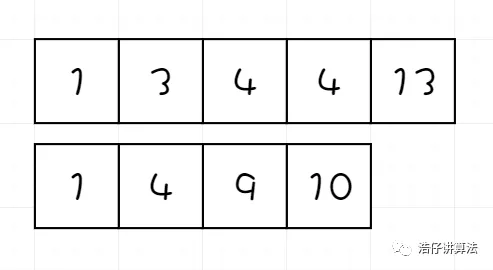
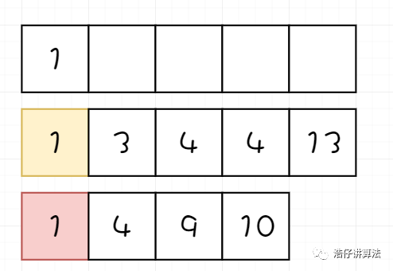
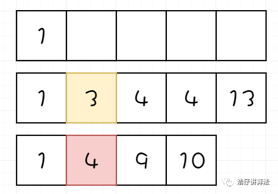
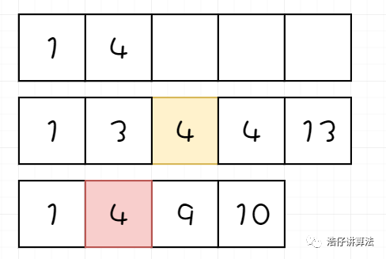
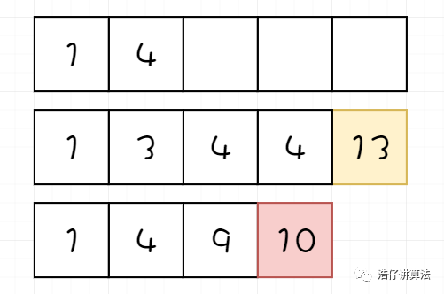

### 01、题目分析

我们先来看一道题目：

| 第350题：两个数组的交集 |
| ----------------------------------------------------- |
| 给定两个数组，编写一个函数来计算它们的交集。 |

**示例 1:**

```
输入: nums1 = [1,2,2,1], nums2 = [2,2]

输出: [2,2]
```

**示例 2:**

```
输入: nums1 = [4,9,5], nums2 = [9,4,9,8,4]

输出: [4,9]
```

说明：

- 输出结果中每个元素出现的次数，应与元素在两个数组中出现的次数一致。
- 我们可以不考虑输出结果的顺序。

进阶:  

- 如果给定的数组已经排好序呢？将如何优化你的算法呢？

思路：设定两个为0的指针，比较两个指针的元素是否相等。如果指针的元素相等，我们将两个指针一起向后移动，并且将相等的元素放入空白数组。

### 02、题解分析

> 首先拿到这道题，我们基本马上可以想到，此题可以看成是一道传统的**映射题（map映射）**，为什么可以这样看呢，因为**我们需找出两个数组的交集元素，同时应与两个数组中出现的次数一致。这样就导致了我们需要知道每个值出现的次数，所以映射关系就成了<元素,出现次数>**。剩下的就是顺利成章的解题。

由于该种解法过于简单，我们不做进一步分析，直接给出题解：

```go
//GO
func intersect(nums1 []int, nums2 []int) []int {
    m0 := map[int]int{}
    for _, v := range nums1 {
        //遍历nums1，初始化map
        m0[v] += 1
    }
    k := 0
    for _, v := range nums2 {
        //如果元素相同，将其存入nums2中，并将出现次数减1
        if m0[v] > 0 {
            m0[v] -=1
            nums2[k] = v
            k++
        }
    }
    return nums2[0:k]
}
```

这个方法比较简单，相信大家都能看的懂！

### 03、题目进阶

> 题目在进阶问题中问道：如果给定的数组已经排好序呢？你将如何优化你的算法？我们分析一下，假如两个数组都是有序的，分别为：arr1 = [1,2,3,4,4,13]，arr2 = [1,2,3,9,10]



对于两个已经排序好数组的题，我们可以很容易想到使用双指针的解法~

解题步骤如下：

<1>设定两个为0的指针，**比较两个指针的元素是否相等。**如果指针的元素相等，我们将两个指针一起向后移动，并且将相等的元素放入空白数组。下图中我们的指针分别指向第一个元素，判断元素相等之后，将相同元素放到空白的数组。



<2>如果两个指针的元素不相等，**我们将小的一个指针后移。**图中我们指针移到下一个元素，判断不相等之后，将元素小的指针向后移动，继续进行判断。



<3>反复以上步骤。



<4>直到任意一个数组终止。



### 04、题目解答

根据分析，我们很容易得到下面的题解：

```go
//GO
func intersect(nums1 []int, nums2 []int) []int {
	i, j, k := 0, 0, 0
	sort.Ints(nums1)
	sort.Ints(nums2)
	for i < len(nums1) && j < len(nums2) {
		if nums1[i] > nums2[j] {
			j++
		} else if nums1[i] < nums2[j] {
			i++
		} else {
			nums1[k] = nums1[i]
			i++
			j++
			k++
		}
	}
	return nums1[:k]
}
```

> 提示：解答中我们并没有创建空白数组，因为遍历后的数组其实就没用了。我们可以**将相等的元素放入用过的数组中，就为我们节省下了空间**。
